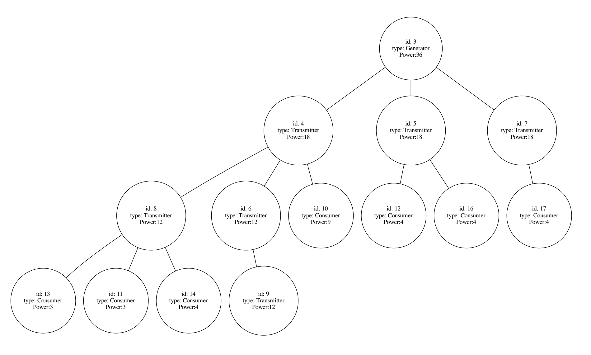

# Electric Power Grid
The project simulates the functions and operations of electric power grid, employing the power of data structures in programming.

## Specification
**The electric power grid** is the network infrastructure responsible for the generation and transmission of electricity. We have three types of elements in a power grid:
- *A generator*: this is a station that generates electricity. A generator has a power limit that it cannot exceed.
  
- *A transmitter*: this is a station that transmits electricity. A transmitter can be connected directly to a generator or to another transmitter. A transmitter has a maximum power that can pass through it.
  
- *A consumer*: this can be a household, a shop, a factory etc. A consumer can only be attached to a transmitter (not directly to a generator), and no element can be attached to it. A consumer has maximum consumption power that it cannot exceed.
  
For simplicity, we assume that **the power grid can be represented as a general (non-binary) tree.** The grid contains only one generator located at the root, whereas consumers are located at leaf nodes. See the figure below for an example.

## Objective
**We are interested in the following:**
1. Finding how much power is generated, transmitted or consumed by an element. This is the total power required by the consumers in the corresponding subtree. 
   
   **Example 1.** In the grid shown in the figure below: Elements 6 and 9 are consuming 0 power, since there are no consumers attached to them. Element 16 consumes 4, Element 8 consumes 10, and Element 4 consumes 19.

2. Whether there is an overload in the grid. An overload takes place when the power required at an element exceeds its capacity. By definition, overloads can only happen at the generator or the transmitters (but not consumers). 
   
   **Example 2.** In the grid shown below, the only element that has an overload is Element 4, since it consumes 19, and its limit is 18.

---
**Example Figure of Grid:**

- Finally, you can find the output of the main class -the test class of the program- [**here**](Project-Code/MainOutput.txt).